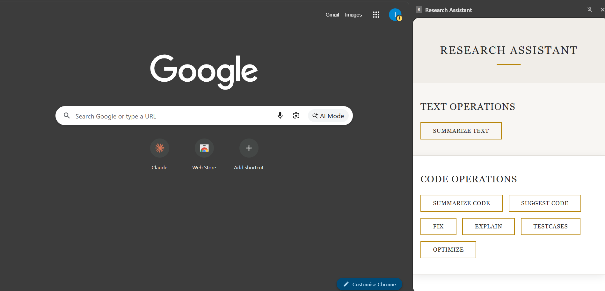
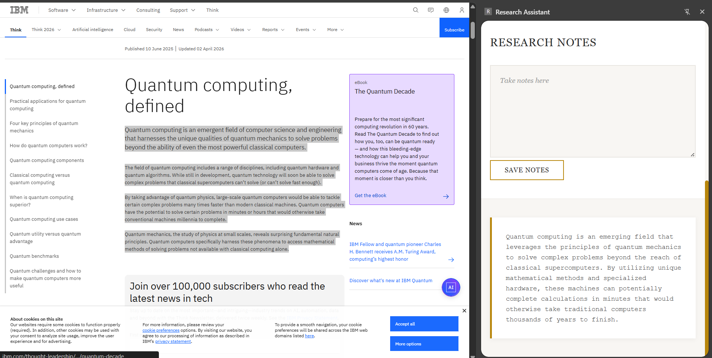
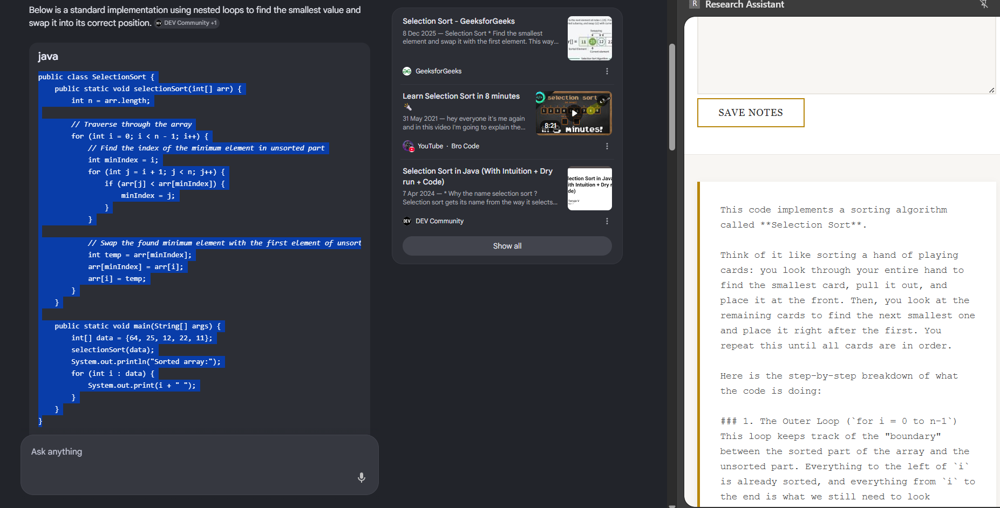
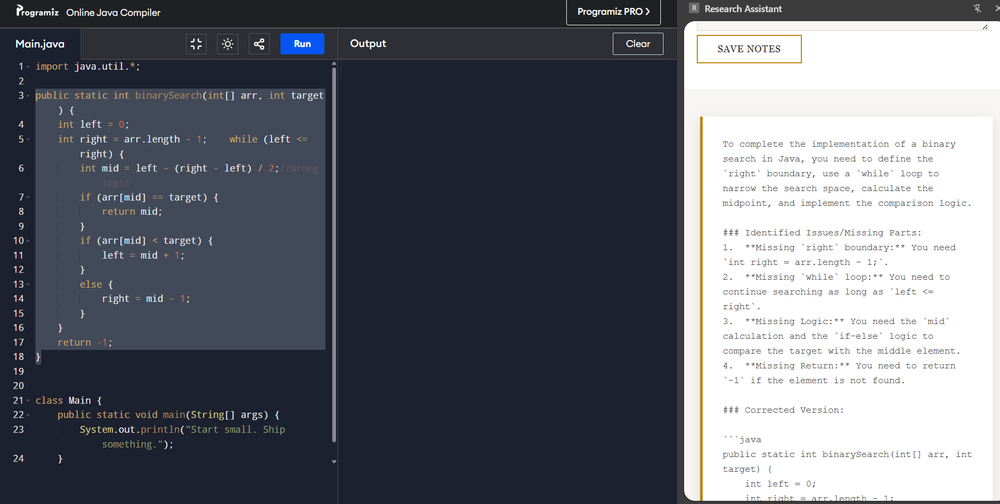

# 🔬 AI Research Assistant

> Intelligent content processing and code analysis powered by Google Gemini AI.


---

## Screenshots

| Landing Page | Summarization |
|---|---|
|  |  |

| Explaining Code | Fixing Code |
|---|---|
|  |  |

---

## Table of Contents

1. [Overview](#1-overview)
2. [Key Features](#2-key-features)
3. [How It Works](#3-how-it-works)
4. [API Reference](#4-api-reference)
5. [Supported Operations](#5-supported-operations)
6. [Tech Stack](#6-tech-stack)
7. [Project Structure](#7-project-structure)
8. [How to Run](#8-how-to-run)
9. [Configuration](#9-configuration)
10. [Future Improvements](#10-future-improvements)
11. [Conclusion](#11-conclusion)

---

## 1. Overview

**AI Research Assistant** is a Spring Boot backend service that acts as an intelligent layer between your content and Google's **Gemini AI** model. It accepts raw text or code via a REST API, applies operation-specific prompts, queries Gemini, and returns structured, human-readable results.

Whether you need to summarize an article, explain a snippet of code, generate unit tests, or fix bugs — this assistant handles it through a single unified endpoint.

---

## 2. Key Features

- 🤖 Gemini AI integration via reactive `WebClient`
- 📝 Text summarization for articles and documents
- 💻 Code summarization, explanation, and fixing
- ✅ Automated unit test case generation
- ⚡ Code optimization suggestions
- 🔍 Related topic and further reading suggestions
- 🔌 Simple REST API — plug into any frontend or tool

---

## 3. How It Works

```
Client Request (content + operation)
↓
ResearchController  (/api/research/process)
↓
ResearchService
↓
Prompt Builder  (operation-specific prompt)
↓
Gemini AI API  (WebClient POST)
↓
GeminiResponse Parser
↓
Extracted Text Response
↓
Client receives result
```

1. The client sends a `POST` request with `content` (text or code) and an `operation` type.
2. `ResearchService` builds a tailored prompt based on the operation.
3. The prompt is sent to the Gemini AI REST API using Spring's reactive `WebClient`.
4. The JSON response is deserialized via `GeminiResponse` (Jackson) and the result text is extracted.
5. The clean text response is returned to the client.

---

## 4. API Reference

### Endpoint

```
POST /api/research/process
```

### Request Body

```json
{
  "content": "your text or code here",
  "operation": "summarize"
}
```

### Response

```
Plain text string containing the AI-generated result.
```

### Example — Summarize Text

```bash
curl -X POST http://localhost:8080/api/research/process \
  -H "Content-Type: application/json" \
  -d '{
    "content": "Quantum computing uses quantum bits (qubits) to perform computations...",
    "operation": "summarize"
  }'
```

### Example — Fix Code

```bash
curl -X POST http://localhost:8080/api/research/process \
  -H "Content-Type: application/json" \
  -d '{
    "content": "public int add(int a, int b { return a + b; }",
    "operation": "fix"
  }'
```

---

## 5. Supported Operations

| Operation | Input | Description |
|-----------|-------|-------------|
| `summarize` | Text / Article | Concise summary in a few sentences |
| `summarize code` | Source code | Plain-English summary of what the code does |
| `suggest code` | Code / Text | Suggests related topics and further reading |
| `fix` | Source code | Identifies and fixes errors, returns corrected code |
| `explain` | Source code | Explains code behaviour in simple terms |
| `testcases` | Source code | Generates comprehensive unit tests |
| `optimize` | Source code | Rewrites code optimized for performance |

---

## 6. Tech Stack

| Technology | Purpose |
|------------|---------|
| Java 17+ | Core language |
| Spring Boot | Application framework |
| Spring WebFlux (WebClient) | Non-blocking HTTP client for Gemini API |
| Google Gemini AI API | Large language model backend |
| Jackson (FasterXML) | JSON serialization / deserialization |
| Lombok | Boilerplate reduction (`@Data`, `@AllArgsConstructor`) |

---

## 7. Project Structure

```
research-assistant/
│
├── assets/
│   ├── Landing_page.png
│   ├── summarization.png
│   ├── explaining_code.png
│   └── fixing_code.png
│
├── src/main/java/com/research/Assistant/
│   ├── ResearchAssistantApplication.java
│   ├── ResearchController.java
│   ├── ResearchService.java
│   ├── ResearchRequest.java
│   └── GeminiResponse.java
│
├── src/main/resources/
│   └── application.properties
│
├── pom.xml              # Maven dependencies
├── LICENSE
└── README.md            
```

---

## 8. How to Run

### Step 1 — Clone the Repository

```bash
git clone https://github.com/your-username/research-assistant
cd research-assistant
```

### Step 2 — Add Your Gemini API Key

Open `src/main/resources/application.properties` and add:

```properties
gemini.api.url=https://generativelanguage.googleapis.com/v1beta/models/gemini-pro:generateContent?key=
gemini.api.key=YOUR_GEMINI_API_KEY_HERE
```

> 🔑 Get your free API key at [Google AI Studio](https://aistudio.google.com/app/apikey).

### Step 3 — Build the Project

```bash
mvn clean install
```

### Step 4 — Run the Application

```bash
mvn spring-boot:run
```

The server starts at `http://localhost:8080`.

---

## 9. Configuration

All configuration lives in `application.properties`:

| Property | Description |
|----------|-------------|
| `gemini.api.url` | Base URL for the Gemini AI endpoint |
| `gemini.api.key` | Your Google Gemini API key |

> ⚠️ **Never commit your API key to version control.** Use environment variables or a secrets manager in production.

---

## 10. Future Improvements

- [ ] Conversation history / multi-turn chat support
- [ ] Support for additional Gemini models (Gemini 1.5 Pro, Flash)
- [ ] Frontend UI (React / Angular)
- [ ] User authentication and request rate limiting
- [ ] Response streaming via Server-Sent Events (SSE)
- [ ] Docker containerization and deployment guide

---

## 11. Conclusion

**AI Research Assistant** demonstrates a clean, production-ready integration of a Spring Boot REST backend with a modern LLM API. It showcases:

- Reactive HTTP communication with `WebClient`
- Structured JSON response handling with Jackson
- Operation-driven prompt engineering
- Clean separation of concerns across Controller → Service → Model layers

This project serves as a strong foundation for any AI-augmented backend service.

---

> ⭐ If you found this project useful, consider giving it a star on GitHub!
